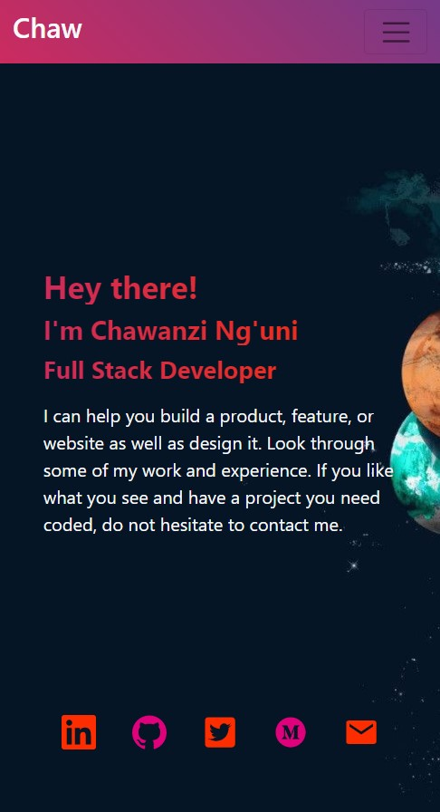
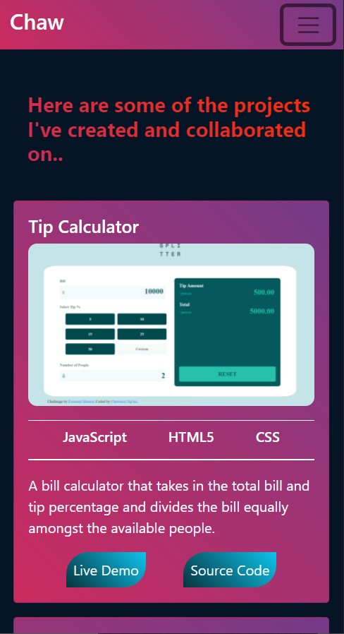
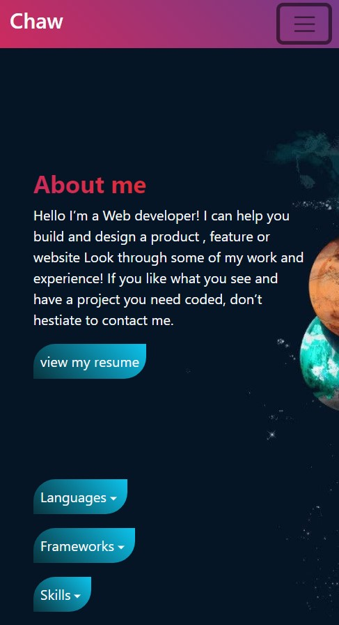
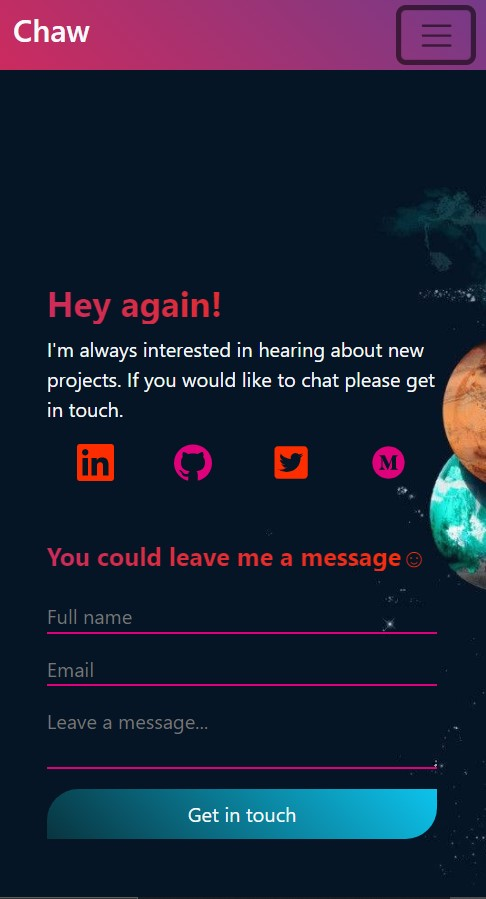

# My Portfolio

>This is my portfolio website, here I upload projects I have worked on.

## Screenshots
> |Home Page|Projects page| About Page | Contact Page |
> |--------------|----------------|----------------|----------------|
> |||||

## Live Version
[See live]()

## Built With
>- ReactJS
>- CSS
>- BootStrap

## To get a local copy run the following steps:
>- Copy this link [[git@github.com:chaw-bot/portfolio-2.git](https://github.com/chaw-bot/portfolio-2)
>- Open your terminal or command line
>- Run "git clone Paste [git@github.com:chaw-bot/portfolio-2.git](git@github.com:chaw-bot/portfolio-2.git)
>- Open the folder with your code editor

# Setup

Run :

```
npm install
```

```
npm start
```
# 👤 **Author**

- **Chawanzi Ng'uni**
  - GitHub: [@chaw-bot](https://github.com/chaw-bot)
  - Twitter: [@chawfronaut](https://twitter.com/chawfronaut)
  - LinkedIn: [Chawanzi Ng'uni](https://www.linkedin.com/in/chawanzi-ng-uni-449328212/) 

# 🤝 Contributing

Contributions, issues, and feature requests are welcome!

Feel free to check the [issues page](https://github.com/chaw-bot/portfolio-2/issues).

# Acknowledgements
- Microverse

## Show your support

Give a ⭐️ if you like this project!
